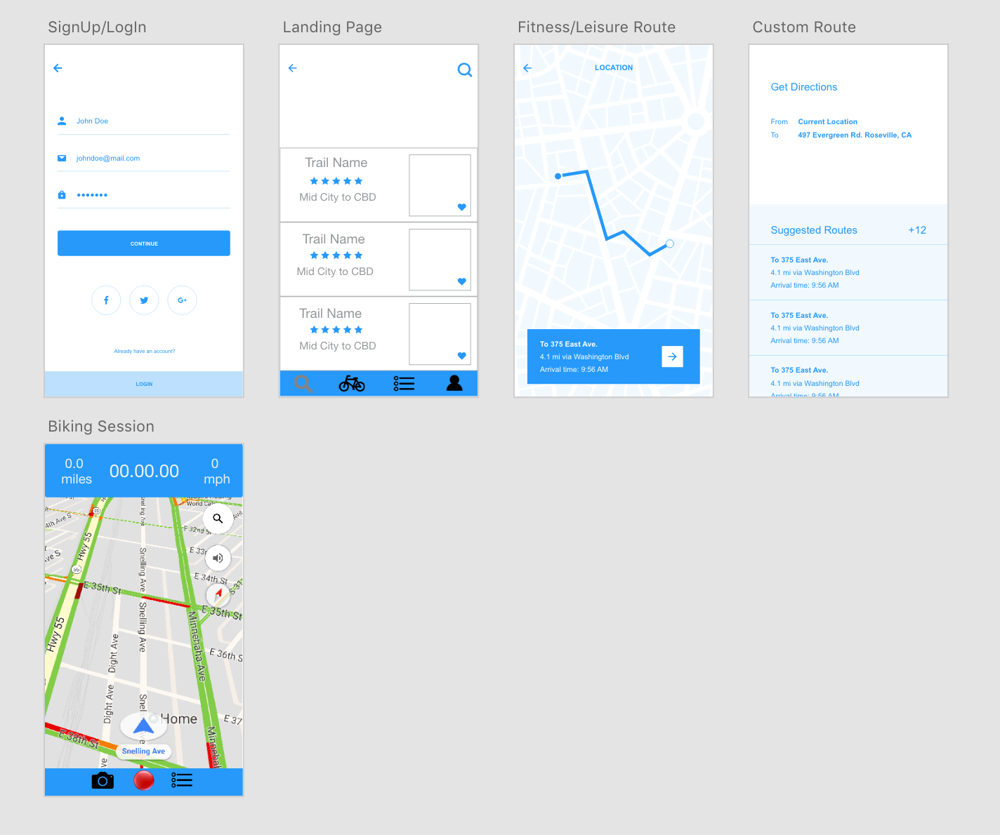

# __bikeMap__

##### *A bike route mapping app*

### Features:
* Creates routes based on user movement
* Displays the availible routes near the user's location
* Allows users to follow routes created by other users
* Stores sessions from using routes and displays statistics about the user
* Gives the user ability favorite routes and use them again
* Uses Facebook for it's authentication, enabling users to use an existing account
<!-- #### Live example
expo:  -->
### __Wireframe__

### __Database__

### __Tech Stack__

### __Installation__

This project uses PostgreSQL for it's database so you will need to host one prior to installing. 

#### Getting the Servers Started
The quickest way to get the server up and running is to use Docker-Compose. There is an example docker-compose.yml in the docs folder. You will need to fill in the environmental variables with your own project's information. Run `docker-compose pull` from the directory with your docker-compose.yml, then `docker-compose up -d` to start the server, and you should be good to go.

If you need to make modifications to the servers and want to keep using Docker, you will need to fork the repos and add them to your own docker hub account. 
### Hosting Without Docker
To run the app without docker, you will need to clone and start each of these repositories with the environmental variables listed. Once cloned with the environmental variables in place, each respective server's modules can be installed with `npm install` and started with `npm start`.

* [bikeMap Proxy Server](https://github.com/honeybadgerhackers/bikeMap-Proxy)
* [bikeMap Database Server](https://github.com/honeybadgerhackers/bikeMap-DBServer)
* [bikeMap Auth Server](https://github.com/honeybadgerhackers/bikeMap-AuthServer)

### Server Environmental Variables

#### Proxy Server
  - PORT="YOUR PORT HERE"
  - API_URL=http://api:3000
  - AUTH_URL=http://auth:3000

#### Database Server
  - PORT="YOUR PORT HERE"
  - DB_HOST="DATABASE URL"
  - DB_PORT="DATABASE PORT"
  - DB_USER="DATABASE USER"
  - DB_PASS="DATABASE PASSWORD"
  - DB_DATABASE="DATABASE NAME"
  - SECRET="YOUR SUPER SECURE SECRET:
  - AUDIENCE=cyclists
  - ISSUER="UP TO YOU"

#### Authentication Server
  - PORT="YOUR PORT HERE"
  - FB_SECRET="FACEBOOK SECRET"
  - FB_APP_ID="YOUR APP ID"

### __Developed By__

* [**Robert Aird**](https://github.com/robertaird)
* [**Patrick Brown Jr**](https://github.com/PJ-26)
* [**Zachary Gagnier**](https://github.com/Zacharygagnier)